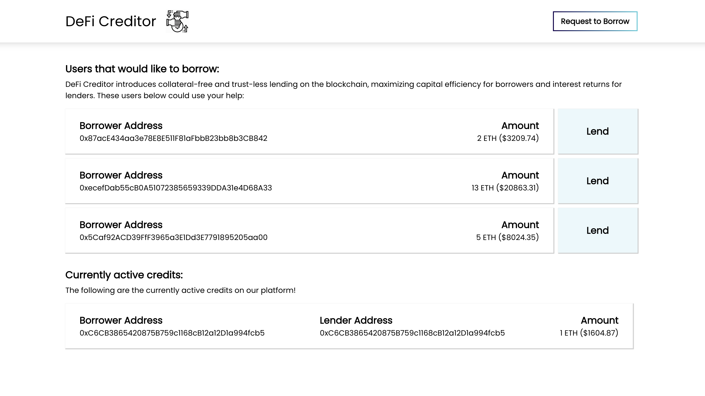
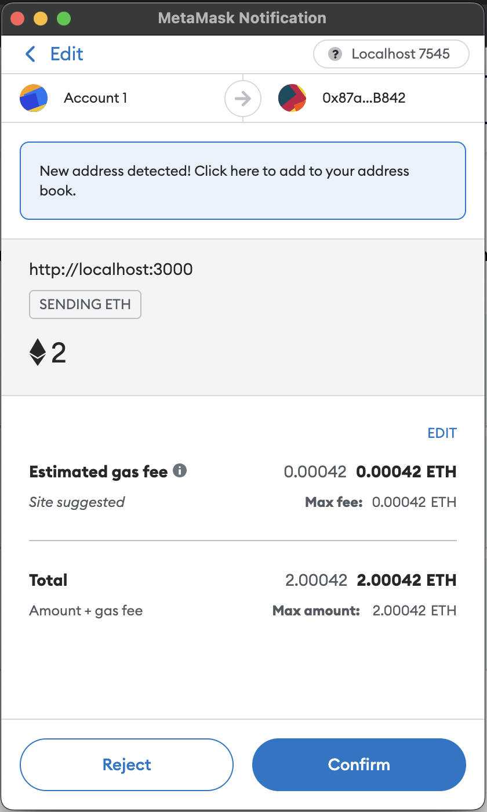
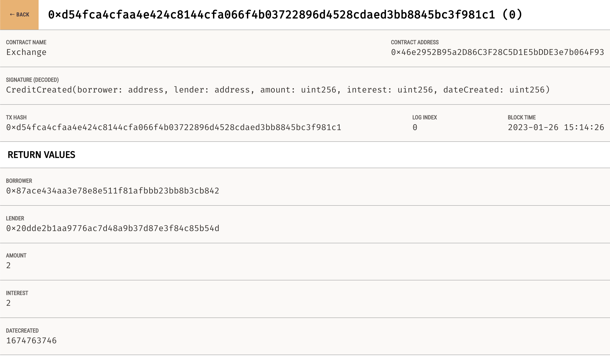
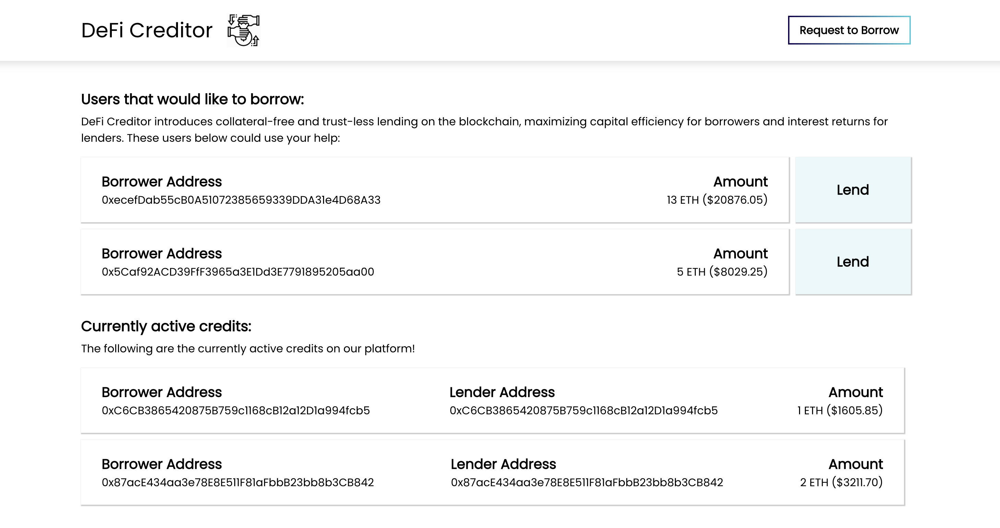
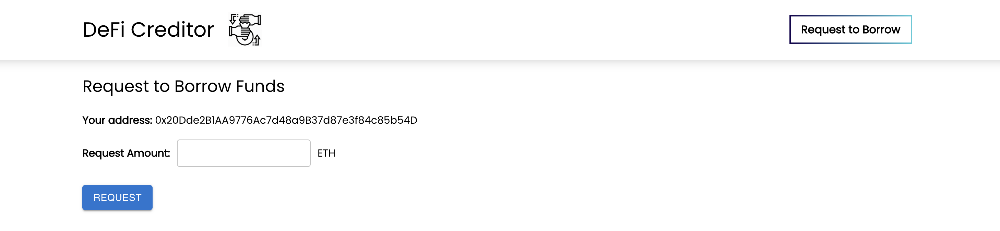
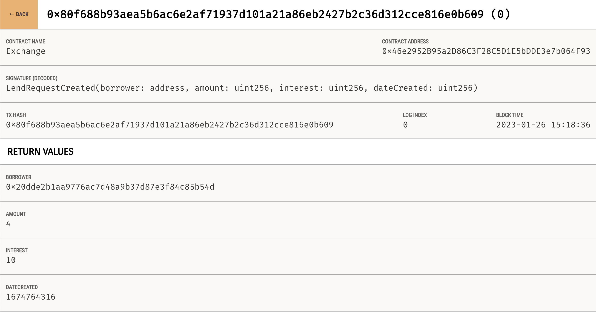
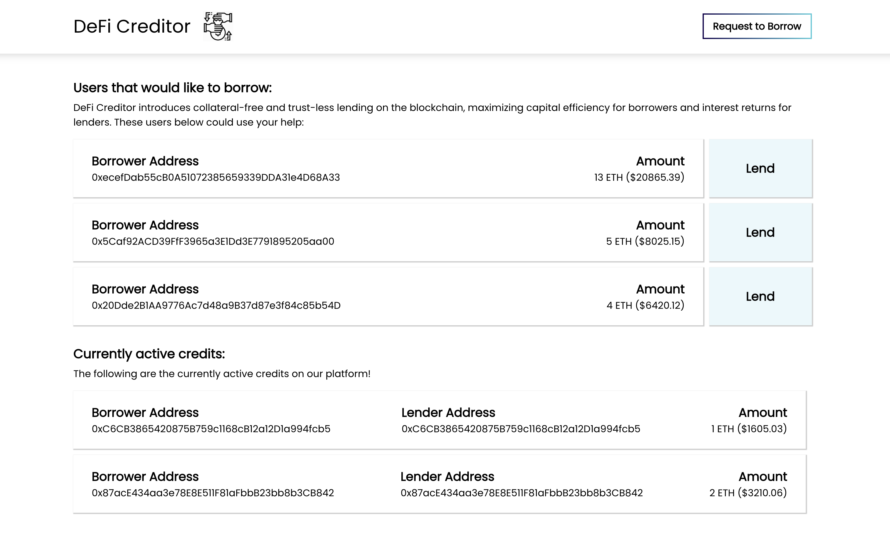

# DeFi Creditor

## Introduction
I created a dApp using Solidity, React.js, and Ethers.js to create my own lending and borrowing protocol. I was interested in a decentralized finance system because it did away with the predatory interest rates and practises that banks would conduct. I wanted to create a trustless system where users had a platform to easily lend and borrow crypto, while setting their own interest rates. 

## Main Page

Here on the main page, you can see different users that have created postings to request funding. They request the amount in ETH, which I also convert to USD for comparison. 

## Lending Money

Upon clicking the "lend" button, the user sees a MetaMask window pop up asking to authorize the transaction. After authorization, the page can be refreshed to see that the credit has moved into an active credit list. This active credit list serves as a display for other users to see that the platform is being used and trusted.

If the user navigates to Ganache, they will see a "CreditCreated" event. This event returns the borrower's address, the lender's address, the amount transferred, the agreed-upon interest rate, and the date of creation.

Here, it can be seen that the credit has moved to the currently active credits list.

## Borrowing Money

To request funding, click the "Request to Borrow" button. Here, the desired amount can be entered. For example, if a user wants to borrow 4 ETH for a project, they can enter that amount and click request. After authorizing the request, Ganache  will see that a LendRequestCreated event has been emitted.

This event essentially contains data such as the borrowers wallet address, the amount they desire, and the interest percentage that they would like to pay. 

After heading over to the main page, the new Credit has been added to the borrow list:

## Future Improvements
In the future, the plan is to introduce a proprietary lending pool, enabling users to stake their holdings and earn revenue through their participation. Additionally, the introduction of a unique cryptocurrency token is being considered as a means to provide assurance to users that the platform is legitimate and not a scam. 
